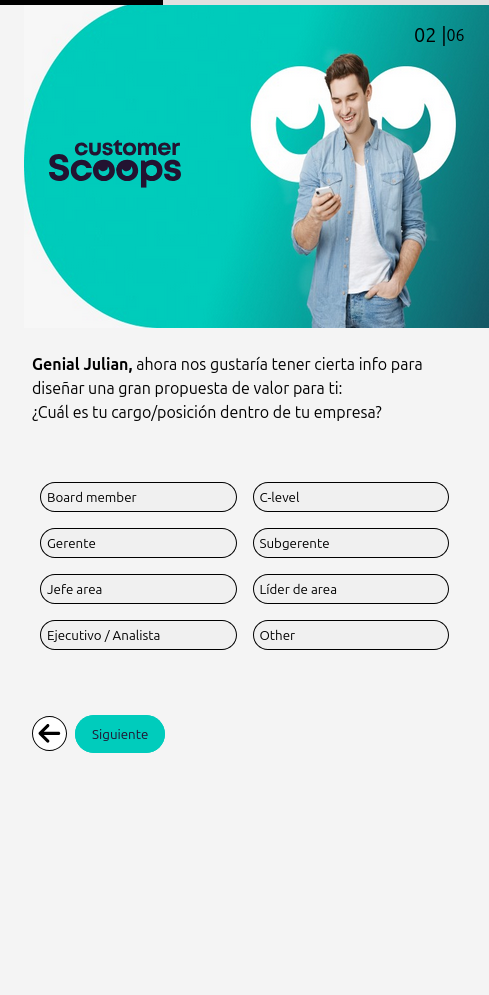
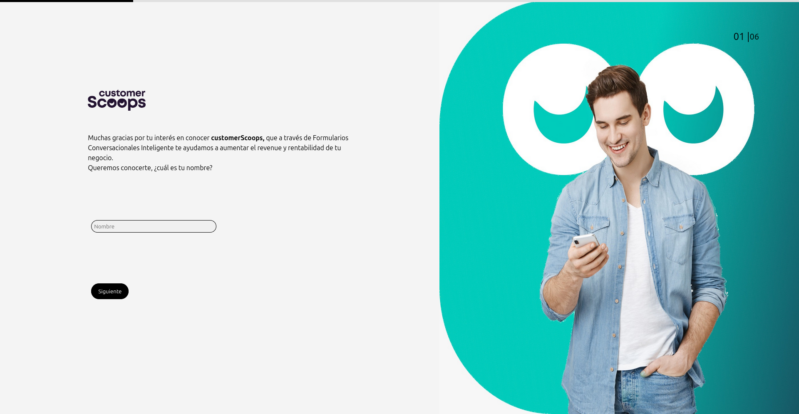
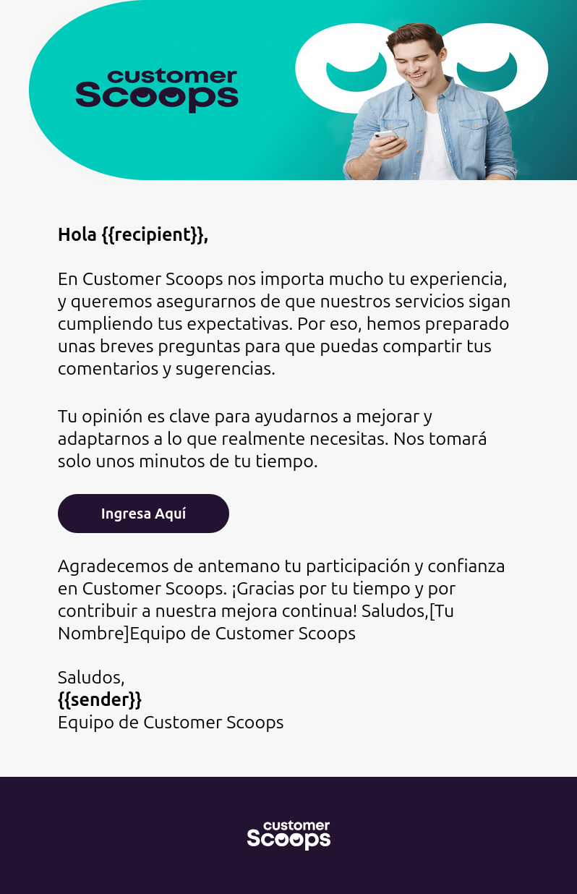

# Proyecto aplicación con React y envío de email con plantilla

Este proyecto es una solución a una prueba técnica que consiste en: una aplicación de React con un formulario tipo encuesta y una aplicación en NodeJS para envío de email con plantilla en html.

## Vista previa





### Plantilla correo

## Enfoque de realización

* Este proyecto lo realicé con un enfoque mobile first para asegurar el diseño responsive.
* Usé CSS modules para estilizar la interfaz de usuario y React con TypeScript.
* Para el envío de correo usé Resend con NodeJS y una plantilla en HTML para la visualización, esta permite interpolar variables para el destinatario y remitente.
* La aplicación de Node está pensada como una prueba de concepto del envío de correos, ya que para funcionar correctamente se debe añadir y verificar un dominio propio el cual no poseo por el momento así como es necesario usar la API_KEY de Resend y no es buena práctica exponer archivos `.env` en repositorios públicos.


## Estructura del Proyecto

- `client-react/`: Directorio del frontend en React
- `email-sender/`: Directorio de la aplicación en NodeJS

## Requisitos

- [Node.js](https://nodejs.org/) (v16 o superior)

## Configuración

### 1. Clonar el repositorio

```bash
git clone https://github.com/juliflorezg/prueba-scoops-julian-florez.git
cd prueba-scoops-julian-florez
```

## Instalación

### 1. Instalar dependencias del frontend

```bash
cd ../client-react
npm install
```

### 2. Instalar dependencias de la aplicación de Node

```bash
cd ../email-sender
npm install
```


## Ejecución del Proyecto


### 1. Iniciar el frontend

Desde el directorio `client-react/`, ejecuta:

```bash
npm run dev
```

Esto iniciará el servidor de desarrollo de Vite para el frontend React.

### 2. Iniciar el backend

Desde el directorio `email-sender/`, ejecuta:

```bash
npm run start
```

Esto ejecutará la aplicación de envío de correos con los parámetros por defecto.

## Scripts Disponibles

### Frontend (React)

- `npm run dev`: Inicia el servidor de desarrollo de Vite
- `npm run build`: Compila la aplicación para producción
- `npm run preview`: Previsualiza la aplicación compilada

### Backend (NodeJS)

- `npm run start`: Ejecuta la aplicación de NodeJS


## Notas

- Asegúrate de que el contenedor de Docker esté corriendo antes de iniciar el backend, ya que el servidor NestJS se conecta a la base de datos PostgreSQL.
- Puedes detener los contenedores de Docker en cualquier momento con `docker-compose down`.

